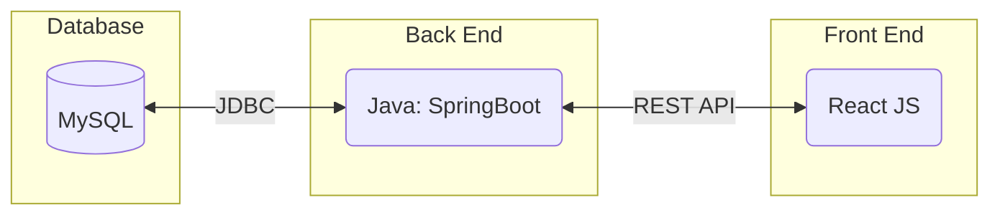
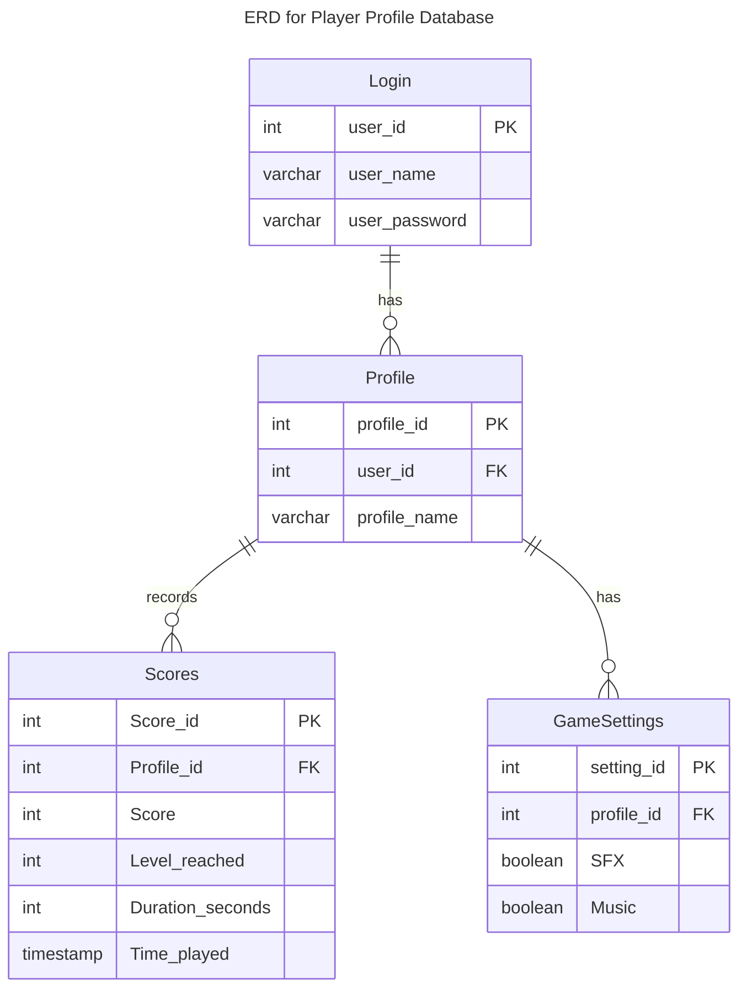

# Specification Document

## TeamName

Pluto

### Project Abstract

Ever wished to relive nostalgic memories playing old video games, but have stayed reluctant because you wish they were more expansive and full of the same charm that has made many modern games so enjoyable? By introducting rogue-like game mechanics to enhance the Atari arcade gaming experience into an ever evolving and ceaselessly unique rogue-lite game, our project aims to benefit from both old and new eras and take a modern spin on the 1980's arcade hit Asteroids.

Our software will be a video game modelled after the Atari game Asteroids and will eventually be infused with features that allow the player to unlock and make permanent progress on their profile. These features may include unlocking new characters, buffs that make the player stronger, challenge gamemodes, etc.

### Customer

The customer-base for our game would be those who are enthusiastic for older-style games, but aren't willing to forgo the many creative additions that have made modern games as treasurable as they are today. The age range for such audience is likely to be centralized within teens and younger adults.

### Specification

The front end will be constructed with HTML and JavaScript using React and the main program will be hosted as an application run from a browser. We will utilize REST API to establish communication between the front end and the back end, which will be programmed in Java. The back end will directly communicate with the database, which will use MySQL.

There will be a database hosted remotely on a server that will store user and profile information, game settings, and leaderboards.

<!--
At some point it will probably be useful to include a couple more UML diagrams. Perhaps an ERD for the database(s) and a sequence diagram to show how interactions occur between the database, backend and frontend.
-->

#### Technology Stack

#### Database

May be modified if needed.

### Standards & Conventions

<!--This is a link to a seperate coding conventions document / style guide-->
[Style Guide & Conventions](STYLE.md)
